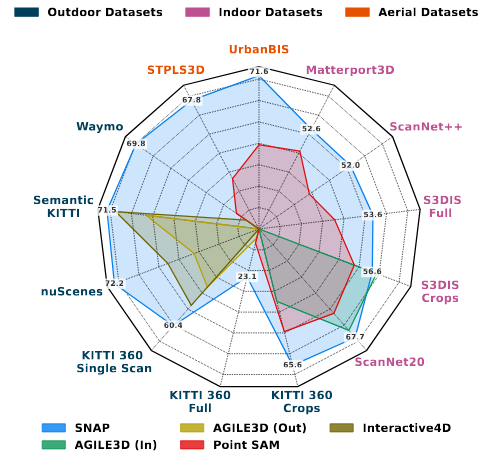

<div align="center">
<h1>SNAP: Towards Segmenting Anything in Any Point Cloud</h1>
<a href="https://arxiv.org/abs/2510.11565"></a>
<a href="https://neu-vi.github.io/SNAP/"></a>

<a href="https://aniket-gupta1.github.io/">Aniket Gupta<sup>1</sup></a>
&nbsp;&nbsp;
<a href="https://sarihust.github.io/">Hanhui Wang<sup>1</sup></a>
&nbsp;&nbsp;
<a href="https://www.linkedin.com/in/charlie-saunders-82b091179/">Charles Saunders<sup>2</sup></a>
&nbsp;&nbsp;
<a href="https://arunirc.github.io/">Aruni RoyChowdhury<sup>2</sup></a>
&nbsp;&nbsp;
<a href="https://coe.northeastern.edu/people/singh-hanumant/">Hanumant Singh<sup>1</sup></a>
&nbsp;&nbsp;
<a href="https://jianghz.me/">Huaizu Jiang<sup>1</sup></a>
<br>
<sup>1</sup> Northeastern University &nbsp;&nbsp;
<sup>2</sup> The Mathworks, Inc.

</div>

This repo is the official project repository for the paper **SNAP: Towards Segmenting Anything in Any Point Cloud**. SNAP is the first model which supports interactive segmentation of point clouds from any domain (indoor, outdoor and aerial). We provide multiple model checkpoints trained on different domains as well as the full model trained on all datasets from different domains.

<p align="center">
      
</p>

<!-- <table>
  <tr>
    <td>
      
    </td>
    <td width="405">
    </td>
  </tr>
</table> -->

## Updates
* [Dec 6, 2025] Code released.
* [Nov 5, 2025] SNAP is accepted for Oral presentation at 3DV 2026.
* [Oct 13, 2025] Preprint released.


## Installation

For the full installation, run
```shell
conda env create -f environment.yaml
conda activate Lidar_Seg
```

For barebones setup, we'll need atleast the following packages:
```shell
conda create -n Lidar_Seg python==3.10
conda activate Lidar_Seg
conda install pytorch==2.4.1 torchvision==0.19.1 torchaudio==2.4.1 pytorch-cuda=12.4 -c pytorch -c nvidia
python -m pip install flash-attn --no-build-isolation
conda install h5py pyyaml -c anaconda -y
conda install tensorboard tensorboardx addict einops scipy plyfile timm hdbscan -c conda-forge -y
conda install pytorch-cluster pytorch-scatter -c pyg -y
python -m pip install spconv-cu120
python -m pip install torch-geometric python-dateutil nuscenes-devkit
conda install pandas
python -m pip install git+https://github.com/openai/CLIP.git
python -m pip install pyvista open3d
python -m pip install PyQt6 pyvistaqt
```

## Interactive Demo
Download the SNAP-C checkpoint from [here](#checkpoints) into a “checkpoints/” folder in the current working directory.
```shell
python iterative_gui_demo.py --pc_path <path to point cloud files> --domain <domain> --resume <path to model checkpoint>
```

Examples for the provided point cloud files:
```shell
python iterative_gui_demo.py --pc_path data_examples/S3DIS/conferenceRoom_1/ --domain Indoor --resume checkpoints/SNAP_C.pth
python iterative_gui_demo.py --pc_path data_examples/ScanNet/scene0011_00 --domain Indoor --resume checkpoints/SNAP_C.pth
python iterative_gui_demo.py --pc_path data_examples/KITTI/000000.bin  --domain Outdoor --resume checkpoints/SNAP_C.pth
python iterative_gui_demo.py --pc_path data_examples/nuScenes/example_3.pcd.bin --domain=Outdoor --resume checkpoints/SNAP_C.pth
```

Once the demo is launched, it'll load the pointcloud in a visualization window, you can segment objects using following steps:
1. Left click to rotate the point cloud, middle click to pan, middle click scroll to zoom in/out and <b>right click to mark prompt points</b>.
2. Right click on a object to segment it. You can mark multiple points on the same object to improve segmentation.
3. Press "New object" button to segment a new object.
4. Press "Finalize Segment" button to finalize the segmentation.

If you want to visualize the results on the complete data (if you have the full dataset), set the data_root parameter in the config file of the respective dataset and run 
```shell
torchrun --nproc_per_node=1 vis_all.py --distributed --use_pdnorm --resume checkpoints/SNAP_C.pth --stage scannet --iterative --enable_amp
```

## Python Snippets to run the model
```shell
# Import the required libraries
from python_demo import PointCloudData, SegmentationModel

# Load the point cloud data
point_cloud = PointCloudData()
point_cloud_data = point_cloud.load_point_cloud("data_examples/KITTI/000000.bin")

# Load the model
model = SegmentationModel(checkpoint_path="/home/thor/Projects/Lidar_Segmentation/checkpoints/SNAP_aerial_outdoor_indoor_epoch_19.pth", domain="Outdoor", grid_size=0.05)

# Intialize the model and run the model backbone to extract point features
point_cloud_data = model.intialize_pointcloud(point_cloud_data)
model.extract_backbone_features(point_cloud_data)

# Specify a prompt point
# prompt_points = [[[x1, y1, z1], [x2, y2, z2], ...]]  # List of prompt pointe, Shape -> M, P, 3 (M = number of objects, P = number of clicks on each object)
# The prompt points should be in the format [x, y, z] and should be in the same coordinate system as the point cloud data
prompt_points = [[[ 9.4854517 ,  7.34119511, -0.40044212]]]

# Run segmentation
masks, text_labels, iou_scores = model.segment(point_cloud_data, prompt_points, text_prompt=None)

# Visualize the results
model.visualize_results(point_cloud_data, masks, text_labels, iou_scores)

```

Note- Outdoor scenes use a grid size of 0.05 and Indoor scenes use a grid size of 0.02.

## Checkpoints
We provide the following checkpoints - 
#### Dataset Models
1. [SNAP - KITTI](https://drive.google.com/file/d/1LGlLWjK9Kz__3WDBWst4PxgUVc44MSga/view?usp=drive_link) - Model trained only on SemanticKITTI dataset
2. [SNAP - ScanNet](https://drive.google.com/file/d/1jym_zdTJlrdEmkZJ4VXDufw4iMmXkjPk/view?usp=drive_link) - Model trained only on ScanNet dataset

#### Domain Models
1. [SNAP - Indoor](https://drive.google.com/file/d/1Sm4J6S9CJxgCF2Rm1hXS16e74CDigYN1/view?usp=drive_link) - Model trained on ScanNet + HM3D
2. [SNAP - Outdoor](https://drive.google.com/file/d/128PoQvnmupWmWWLWNfzHyyQrv2nUpukq/view?usp=drive_link) - Model trained on SemanticKITTI + nuScenes + Pandaset
3. [SNAP - Aerial](https://drive.google.com/file/d/1VnRuXuLfxs-CTG5_bAbJ5MO7Kd-MSCAK/view?usp=drive_link) - Model trained on STPLS3D + DALES

#### Full Models
1. [SNAP - C ](https://drive.google.com/file/d/1xGzyOxUPhXLRO8rdOWX9NOetAdBg9q0w/view?usp=drive_link) - Model trained on ScanNet + HM3D + SemanticKITTI + nuScenes + Pandaset + STPLS3D + DALES (Recommended for general use)
2. [SNAP - C (without HM3D)](https://drive.google.com/file/d/10MXoZMGUhLBCrsYWtZNbxehHpqTw58km/view?usp=drive_link) - - Model trained on ScanNet + SemanticKITTI + nuScenes + Pandaset + STPLS3D + DALES. 
3. [SNAP - C (without HM3D + variable grid sizes)](https://drive.google.com/file/d/1OSlVecpMOHmjecII1JZTJdzr0TJY1tdY/view?usp=drive_link) - - Model trained on ScanNet + HM3D + SemanticKITTI + nuScenes + Pandaset + STPLS3D + DALES along with variable grid sizes data augmentation. (Recommended for use when using different voxelization sizes than the default ones used.)

## Training
### Data
* **Outdoor**:- [SemanticKITTI](https://semantic-kitti.org/), [Nuscenes](https://www.nuscenes.org/), 
[Pandaset](https://scale.com/open-av-datasets/pandaset)
* **Indoor**:- [ScanNet200](https://rozdavid.github.io/scannet200), [HM3D](https://niessner.github.io/HM3D/)
* **Aerial**:- [DALES](https://udayton.edu/engineering/research/centers/vision_lab/research/was_data_analysis_and_processing/dale.php), [STPLS3D](https://www.stpls3d.com/)

### Scripts
```shell
torchrun --nproc_per_node=1 main.py --distributed --use_pdnorm --resume <path to checkpoint to resume from> --stage <datasets you want to train on> --iterative --enable_amp --use_localized_loss --use_aux_loss --use_random_clicks --use_pdnorm 
```

## Evaluation
```shell
torchrun --nproc_per_node=1 main.py --exp_name <experiment_name> --stage <dataset_name> --compute_NOC --enable_amp --use_pdnorm --distributed --batch_size=1 --num_workers=8 --num_prompt_points=20 --num_object_chunk=16 --iterative --use_centroid --val_only --resume checkpoints/SNAP_C.pth
```

Note that use_centroid flag enables the use of centroid prompts during evaluation and val_only flag runs only the validation loop.


## Citation

```bibtex
@misc{gupta2025snapsegmentingpointcloud,
      title={SNAP: Towards Segmenting Anything in Any Point Cloud}, 
      author={Aniket Gupta and Hanhui Wang and Charles Saunders and Aruni RoyChowdhury and Hanumant Singh and Huaizu Jiang},
      year={2025},
      eprint={2510.11565},
      archivePrefix={arXiv},
      primaryClass={cs.CV},
      url={https://arxiv.org/abs/2510.11565}, 
}
```

## Acknowledgements
We thank the authors of [PointTransformerV3](https://github.com/Pointcept/PointTransformerV3) and [Pointcept](https://github.com/Pointcept/Pointcept) for their open-source codebases which were used in parts of this project. 